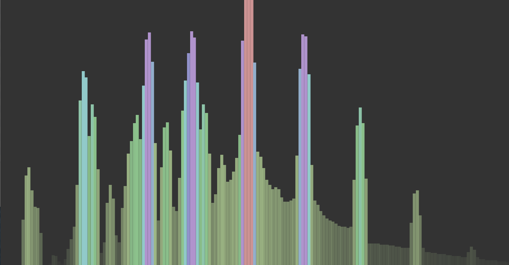

skynetheremin
=============

A distributed theremin, powered by a Leap Motion controller, a user-interface device that tracks the user's hand motions.

## Demo App Usage

Using Chrome, go to: http://skynetheremin.herokuapp.com/

Click and drag on the screen to make your own music.

During a demonstration, you should also hear music coming from the sky.

## Tech Notes

To install all libraries for this app, pull the code and run:

    npm install

The post-install hooks should also grab the bower libraries.

There are three major components: the server, the broadcaster, and the web client.

### Server

The server is a lightweight express app written in node. Basically all it does is handle websockets between the web clients, and re-broadcasts information from the broadcaster to each web client.

To run the server locally:

    node app/server.js

### Broadcaster

The broadcaster handles reading information from the Leap Motion, and sending that information to the server. It makes use of [Cylon.js](https://github.com/hybridgroup/cylon-leapmotion) to 

To run the broadcaster:

    node app/client.js [target]

Ex:

    node app/client.js http://skynetheremin.herokuapp.com/

Press spacebar to start and stop broadcasting.

### Web Client

The web client so far works well on Chrome and works (???) on Firefox and Safari. The main features are:

* Accepts mouse dragging inputs from the user to create sound
* Renders sound into a pleasant-looking visualization
* Establishes a connection to the remote server to receive instructions from the broadcaster

The sound is synthesized using Web Audio.

The basic UI was inspired by (and/or reverse-engineered from) the Theremin by [Femur Designs](http://www.femurdesign.com/theremin/).

## Deployment

This node app is set up to deploy to heroku. To do so, websockets must be enabled. For more information, check out the following articles:

* https://devcenter.heroku.com/articles/getting-started-with-nodejs
* https://devcenter.heroku.com/articles/node-websockets
